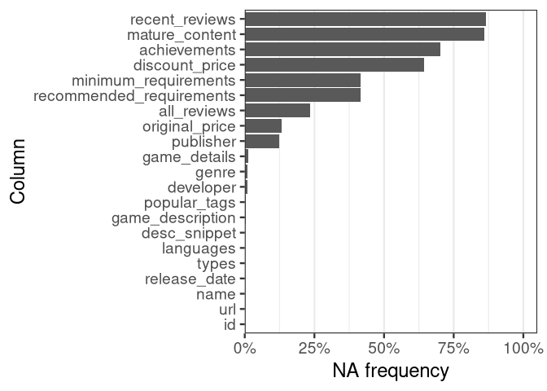
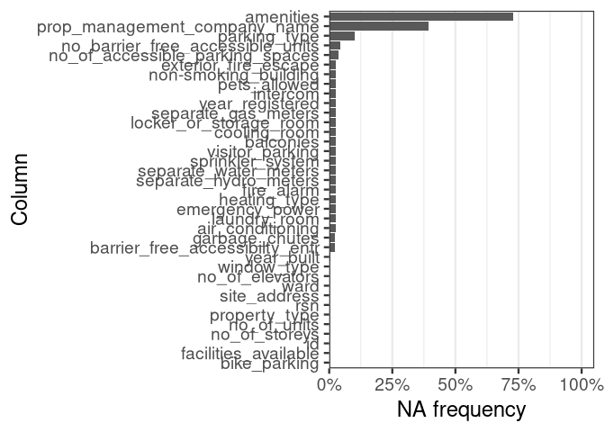
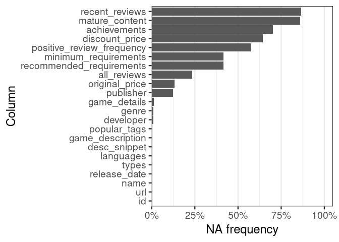
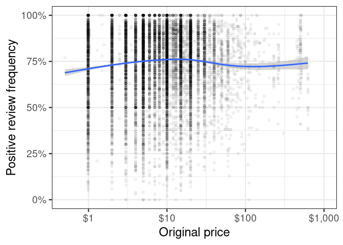
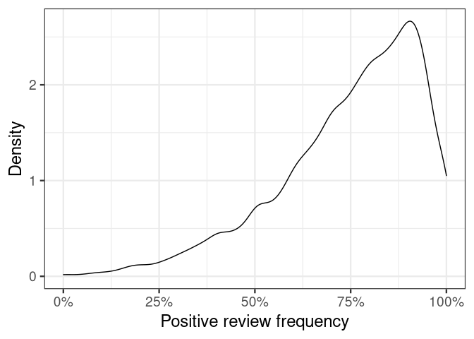
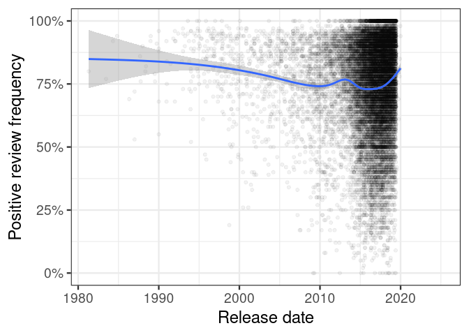
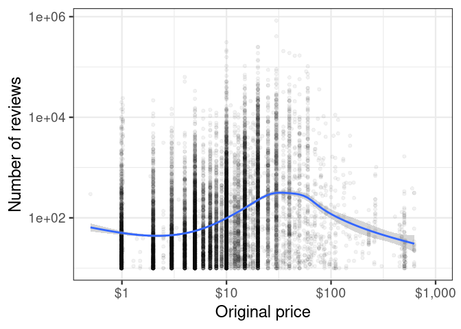
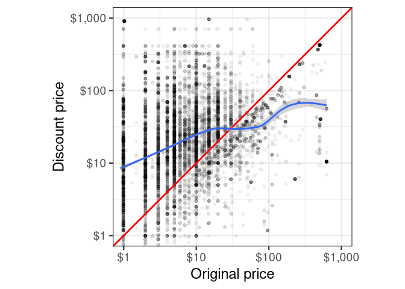

Mini Data-Analysis Deliverable 1
================

# Welcome to your (maybe) first-ever data analysis project!

And hopefully the first of many. Let’s get started:

1.  Install the [`datateachr`](https://github.com/UBC-MDS/datateachr)
    package by typing the following into your **R terminal**:

<!-- -->

    install.packages("devtools")
    devtools::install_github("UBC-MDS/datateachr")

2.  Load the packages below.

``` r
library(datateachr)
library(tidyverse)
```

    ## ── Attaching packages ─────────────────────────────────────── tidyverse 1.3.2 ──
    ## ✔ ggplot2 3.3.6      ✔ purrr   0.3.4 
    ## ✔ tibble  3.1.8      ✔ dplyr   1.0.10
    ## ✔ tidyr   1.2.1      ✔ stringr 1.4.1 
    ## ✔ readr   2.1.3      ✔ forcats 0.5.2 
    ## ── Conflicts ────────────────────────────────────────── tidyverse_conflicts() ──
    ## ✖ dplyr::filter() masks stats::filter()
    ## ✖ dplyr::lag()    masks stats::lag()

3.  Make a repository in the <https://github.com/stat545ubc-2022>
    Organization. You will be working with this repository for the
    entire data analysis project. You can either make it public, or make
    it private and add the TA’s and Lucy as collaborators. A link to
    help you create a private repository is available on the
    #collaborative-project Slack channel.

# Instructions

## For Both Milestones

-   Each milestone is worth 45 points. The number of points allocated to
    each task will be annotated within each deliverable. Tasks that are
    more challenging will often be allocated more points.

-   10 points will be allocated to the reproducibility, cleanliness, and
    coherence of the overall analysis. While the two milestones will be
    submitted as independent deliverables, the analysis itself is a
    continuum - think of it as two chapters to a story. Each chapter, or
    in this case, portion of your analysis, should be easily followed
    through by someone unfamiliar with the content.
    [Here](https://swcarpentry.github.io/r-novice-inflammation/06-best-practices-R/)
    is a good resource for what constitutes “good code”. Learning good
    coding practices early in your career will save you hassle later on!

## For Milestone 1

**To complete this milestone**, edit [this very `.Rmd`
file](https://raw.githubusercontent.com/UBC-STAT/stat545.stat.ubc.ca/master/content/mini-project/mini-project-1.Rmd)
directly. Fill in the sections that are tagged with
`<!--- start your work below --->`.

**To submit this milestone**, make sure to knit this `.Rmd` file to an
`.md` file by changing the YAML output settings from
`output: html_document` to `output: github_document`. Commit and push
all of your work to the mini-analysis GitHub repository you made
earlier, and tag a release on GitHub. Then, submit a link to your tagged
release on canvas.

**Points**: This milestone is worth 45 points: 43 for your analysis, 1
point for having your Milestone 1 document knit error-free, and 1 point
for tagging your release on Github.

# Learning Objectives

By the end of this milestone, you should:

-   Become familiar with your dataset of choosing
-   Select 4 questions that you would like to answer with your data
-   Generate a reproducible and clear report using R Markdown
-   Become familiar with manipulating and summarizing your data in
    tibbles using `dplyr`, with a research question in mind.

# Task 1: Choose your favorite dataset (10 points)

The `datateachr` package by Hayley Boyce and Jordan Bourak currently
composed of 7 semi-tidy datasets for educational purposes. Here is a
brief description of each dataset:

-   *apt_buildings*: Acquired courtesy of The City of Toronto’s Open
    Data Portal. It currently has 3455 rows and 37 columns.

-   *building_permits*: Acquired courtesy of The City of Vancouver’s
    Open Data Portal. It currently has 20680 rows and 14 columns.

-   *cancer_sample*: Acquired courtesy of UCI Machine Learning
    Repository. It currently has 569 rows and 32 columns.

-   *flow_sample*: Acquired courtesy of The Government of Canada’s
    Historical Hydrometric Database. It currently has 218 rows and 7
    columns.

-   *parking_meters*: Acquired courtesy of The City of Vancouver’s Open
    Data Portal. It currently has 10032 rows and 22 columns.

-   *steam_games*: Acquired courtesy of Kaggle. It currently has 40833
    rows and 21 columns.

-   *vancouver_trees*: Acquired courtesy of The City of Vancouver’s Open
    Data Portal. It currently has 146611 rows and 20 columns.

**Things to keep in mind**

-   We hope that this project will serve as practice for carrying our
    your own *independent* data analysis. Remember to comment your code,
    be explicit about what you are doing, and write notes in this
    markdown document when you feel that context is required. As you
    advance in the project, prompts and hints to do this will be
    diminished - it’ll be up to you!

-   Before choosing a dataset, you should always keep in mind **your
    goal**, or in other ways, *what you wish to achieve with this data*.
    This mini data-analysis project focuses on *data wrangling*,
    *tidying*, and *visualization*. In short, it’s a way for you to get
    your feet wet with exploring data on your own.

And that is exactly the first thing that you will do!

1.1 Out of the 7 datasets available in the `datateachr` package, choose
**4** that appeal to you based on their description. Write your choices
below:

**Note**: We encourage you to use the ones in the `datateachr` package,
but if you have a dataset that you’d really like to use, you can include
it here. But, please check with a member of the teaching team to see
whether the dataset is of appropriate complexity. Also, include a
**brief** description of the dataset here to help the teaching team
understand your data.

<!-------------------------- Start your work below ---------------------------->

1.  `steam_games`
2.  `cancer_sample`
3.  `apt_buildings`
4.  `parking_meters`

<!----------------------------------------------------------------------------->

1.2 One way to narrowing down your selection is to *explore* the
datasets. Use your knowledge of dplyr to find out at least *3*
attributes about each of these datasets (an attribute is something such
as number of rows, variables, class type…). The goal here is to have an
idea of *what the data looks like*.

*Hint:* This is one of those times when you should think about the
cleanliness of your analysis. I added a single code chunk for you below,
but do you want to use more than one? Would you like to write more
comments outside of the code chunk?

<!-------------------------- Start your work below ---------------------------->

``` r
FONT_SIZE <- 18
```

``` r
plot_na_frequency <- function(
    data
) {
    # Calculate NA frequency for each column
    plot_data <-
        data |>
        map_dbl(~ mean(is.na(.x))) |>
        enframe(name = "column", value = "na_frequency")

    # Generate NA frequency plot
    plot <-
        plot_data |>
        ggplot(aes(x = fct_reorder(column, na_frequency), y = na_frequency)) +
        geom_col() +
        coord_flip() +
        scale_y_continuous(
            labels = scales::label_percent(),
            limits = c(0, 1),
            expand = expansion(add = c(0, 0.05))
        ) +
        theme_bw(FONT_SIZE) +
        theme(panel.grid.major.y = element_blank()) +
        labs(
            x = "Column",
            y = "NA frequency"
        )

    # Return plot
    return(plot)
}
```

``` r
# `steam_games` attributes
# Number of rows: 40 833
# Number of columns: 21
# Percentage of missing data for each column: Check plot below
glimpse(steam_games)
```

    ## Rows: 40,833
    ## Columns: 21
    ## $ id                       <dbl> 1, 2, 3, 4, 5, 6, 7, 8, 9, 10, 11, 12, 13, 14…
    ## $ url                      <chr> "https://store.steampowered.com/app/379720/DO…
    ## $ types                    <chr> "app", "app", "app", "app", "app", "bundle", …
    ## $ name                     <chr> "DOOM", "PLAYERUNKNOWN'S BATTLEGROUNDS", "BAT…
    ## $ desc_snippet             <chr> "Now includes all three premium DLC packs (Un…
    ## $ recent_reviews           <chr> "Very Positive,(554),- 89% of the 554 user re…
    ## $ all_reviews              <chr> "Very Positive,(42,550),- 92% of the 42,550 u…
    ## $ release_date             <chr> "May 12, 2016", "Dec 21, 2017", "Apr 24, 2018…
    ## $ developer                <chr> "id Software", "PUBG Corporation", "Harebrain…
    ## $ publisher                <chr> "Bethesda Softworks,Bethesda Softworks", "PUB…
    ## $ popular_tags             <chr> "FPS,Gore,Action,Demons,Shooter,First-Person,…
    ## $ game_details             <chr> "Single-player,Multi-player,Co-op,Steam Achie…
    ## $ languages                <chr> "English,French,Italian,German,Spanish - Spai…
    ## $ achievements             <dbl> 54, 37, 128, NA, NA, NA, 51, 55, 34, 43, 72, …
    ## $ genre                    <chr> "Action", "Action,Adventure,Massively Multipl…
    ## $ game_description         <chr> "About This Game Developed by id software, th…
    ## $ mature_content           <chr> NA, "Mature Content Description  The develope…
    ## $ minimum_requirements     <chr> "Minimum:,OS:,Windows 7/8.1/10 (64-bit versio…
    ## $ recommended_requirements <chr> "Recommended:,OS:,Windows 7/8.1/10 (64-bit ve…
    ## $ original_price           <dbl> 19.99, 29.99, 39.99, 44.99, 0.00, NA, 59.99, …
    ## $ discount_price           <dbl> 14.99, NA, NA, NA, NA, 35.18, 70.42, 17.58, N…

``` r
plot_na_frequency(steam_games)
```

<!-- -->

``` r
# `cancer_sample` attributes
# Number of rows: 569
# Number of columns: 32
# Percentage of missing data for each column: Check plot below
glimpse(cancer_sample)
```

    ## Rows: 569
    ## Columns: 32
    ## $ ID                      <dbl> 842302, 842517, 84300903, 84348301, 84358402, …
    ## $ diagnosis               <chr> "M", "M", "M", "M", "M", "M", "M", "M", "M", "…
    ## $ radius_mean             <dbl> 17.990, 20.570, 19.690, 11.420, 20.290, 12.450…
    ## $ texture_mean            <dbl> 10.38, 17.77, 21.25, 20.38, 14.34, 15.70, 19.9…
    ## $ perimeter_mean          <dbl> 122.80, 132.90, 130.00, 77.58, 135.10, 82.57, …
    ## $ area_mean               <dbl> 1001.0, 1326.0, 1203.0, 386.1, 1297.0, 477.1, …
    ## $ smoothness_mean         <dbl> 0.11840, 0.08474, 0.10960, 0.14250, 0.10030, 0…
    ## $ compactness_mean        <dbl> 0.27760, 0.07864, 0.15990, 0.28390, 0.13280, 0…
    ## $ concavity_mean          <dbl> 0.30010, 0.08690, 0.19740, 0.24140, 0.19800, 0…
    ## $ concave_points_mean     <dbl> 0.14710, 0.07017, 0.12790, 0.10520, 0.10430, 0…
    ## $ symmetry_mean           <dbl> 0.2419, 0.1812, 0.2069, 0.2597, 0.1809, 0.2087…
    ## $ fractal_dimension_mean  <dbl> 0.07871, 0.05667, 0.05999, 0.09744, 0.05883, 0…
    ## $ radius_se               <dbl> 1.0950, 0.5435, 0.7456, 0.4956, 0.7572, 0.3345…
    ## $ texture_se              <dbl> 0.9053, 0.7339, 0.7869, 1.1560, 0.7813, 0.8902…
    ## $ perimeter_se            <dbl> 8.589, 3.398, 4.585, 3.445, 5.438, 2.217, 3.18…
    ## $ area_se                 <dbl> 153.40, 74.08, 94.03, 27.23, 94.44, 27.19, 53.…
    ## $ smoothness_se           <dbl> 0.006399, 0.005225, 0.006150, 0.009110, 0.0114…
    ## $ compactness_se          <dbl> 0.049040, 0.013080, 0.040060, 0.074580, 0.0246…
    ## $ concavity_se            <dbl> 0.05373, 0.01860, 0.03832, 0.05661, 0.05688, 0…
    ## $ concave_points_se       <dbl> 0.015870, 0.013400, 0.020580, 0.018670, 0.0188…
    ## $ symmetry_se             <dbl> 0.03003, 0.01389, 0.02250, 0.05963, 0.01756, 0…
    ## $ fractal_dimension_se    <dbl> 0.006193, 0.003532, 0.004571, 0.009208, 0.0051…
    ## $ radius_worst            <dbl> 25.38, 24.99, 23.57, 14.91, 22.54, 15.47, 22.8…
    ## $ texture_worst           <dbl> 17.33, 23.41, 25.53, 26.50, 16.67, 23.75, 27.6…
    ## $ perimeter_worst         <dbl> 184.60, 158.80, 152.50, 98.87, 152.20, 103.40,…
    ## $ area_worst              <dbl> 2019.0, 1956.0, 1709.0, 567.7, 1575.0, 741.6, …
    ## $ smoothness_worst        <dbl> 0.1622, 0.1238, 0.1444, 0.2098, 0.1374, 0.1791…
    ## $ compactness_worst       <dbl> 0.6656, 0.1866, 0.4245, 0.8663, 0.2050, 0.5249…
    ## $ concavity_worst         <dbl> 0.71190, 0.24160, 0.45040, 0.68690, 0.40000, 0…
    ## $ concave_points_worst    <dbl> 0.26540, 0.18600, 0.24300, 0.25750, 0.16250, 0…
    ## $ symmetry_worst          <dbl> 0.4601, 0.2750, 0.3613, 0.6638, 0.2364, 0.3985…
    ## $ fractal_dimension_worst <dbl> 0.11890, 0.08902, 0.08758, 0.17300, 0.07678, 0…

``` r
plot_na_frequency(cancer_sample)
```

<!-- -->

``` r
# `apt_buildings` attributes
# Number of rows: 3 455
# Number of columns: 37
# Percentage of missing data for each column: Check plot below
glimpse(apt_buildings)
```

    ## Rows: 3,455
    ## Columns: 37
    ## $ id                               <dbl> 10359, 10360, 10361, 10362, 10363, 10…
    ## $ air_conditioning                 <chr> "NONE", "NONE", "NONE", "NONE", "NONE…
    ## $ amenities                        <chr> "Outdoor rec facilities", "Outdoor po…
    ## $ balconies                        <chr> "YES", "YES", "YES", "YES", "NO", "NO…
    ## $ barrier_free_accessibilty_entr   <chr> "YES", "NO", "NO", "YES", "NO", "NO",…
    ## $ bike_parking                     <chr> "0 indoor parking spots and 10 outdoo…
    ## $ exterior_fire_escape             <chr> "NO", "NO", "NO", "YES", "NO", NA, "N…
    ## $ fire_alarm                       <chr> "YES", "YES", "YES", "YES", "YES", "Y…
    ## $ garbage_chutes                   <chr> "YES", "YES", "NO", "NO", "NO", "NO",…
    ## $ heating_type                     <chr> "HOT WATER", "HOT WATER", "HOT WATER"…
    ## $ intercom                         <chr> "YES", "YES", "YES", "YES", "YES", "Y…
    ## $ laundry_room                     <chr> "YES", "YES", "YES", "YES", "YES", "Y…
    ## $ locker_or_storage_room           <chr> "NO", "YES", "YES", "YES", "NO", "YES…
    ## $ no_of_elevators                  <dbl> 3, 3, 0, 1, 0, 0, 0, 2, 4, 2, 0, 2, 2…
    ## $ parking_type                     <chr> "Underground Garage , Garage accessib…
    ## $ pets_allowed                     <chr> "YES", "YES", "YES", "YES", "YES", "Y…
    ## $ prop_management_company_name     <chr> NA, "SCHICKEDANZ BROS. PROPERTIES", N…
    ## $ property_type                    <chr> "PRIVATE", "PRIVATE", "PRIVATE", "PRI…
    ## $ rsn                              <dbl> 4154812, 4154815, 4155295, 4155309, 4…
    ## $ separate_gas_meters              <chr> "NO", "NO", "NO", "NO", "NO", "NO", "…
    ## $ separate_hydro_meters            <chr> "YES", "YES", "YES", "YES", "YES", "Y…
    ## $ separate_water_meters            <chr> "NO", "NO", "NO", "NO", "NO", "NO", "…
    ## $ site_address                     <chr> "65  FOREST MANOR RD", "70  CLIPPER R…
    ## $ sprinkler_system                 <chr> "YES", "YES", "NO", "YES", "NO", "NO"…
    ## $ visitor_parking                  <chr> "PAID", "FREE", "UNAVAILABLE", "UNAVA…
    ## $ ward                             <chr> "17", "17", "03", "03", "02", "02", "…
    ## $ window_type                      <chr> "DOUBLE PANE", "DOUBLE PANE", "DOUBLE…
    ## $ year_built                       <dbl> 1967, 1970, 1927, 1959, 1943, 1952, 1…
    ## $ year_registered                  <dbl> 2017, 2017, 2017, 2017, 2017, NA, 201…
    ## $ no_of_storeys                    <dbl> 17, 14, 4, 5, 4, 4, 4, 7, 32, 4, 4, 7…
    ## $ emergency_power                  <chr> "NO", "YES", "NO", "NO", "NO", "NO", …
    ## $ `non-smoking_building`           <chr> "YES", "NO", "YES", "YES", "YES", "NO…
    ## $ no_of_units                      <dbl> 218, 206, 34, 42, 25, 34, 14, 105, 57…
    ## $ no_of_accessible_parking_spaces  <dbl> 8, 10, 20, 42, 12, 0, 5, 1, 1, 6, 12,…
    ## $ facilities_available             <chr> "Recycling bins", "Green Bin / Organi…
    ## $ cooling_room                     <chr> "NO", "NO", "NO", "NO", "NO", "NO", "…
    ## $ no_barrier_free_accessible_units <dbl> 2, 0, 0, 42, 0, NA, 14, 0, 0, 1, 25, …

``` r
plot_na_frequency(apt_buildings)
```

<!-- -->

``` r
# `parking_meters` attributes
# Number of rows: 10 032
# Number of columns: 22
# Percentage of missing data for each column: Check plot below
glimpse(parking_meters)
```

    ## Rows: 10,032
    ## Columns: 22
    ## $ meter_head     <chr> "Twin", "Pay Station", "Twin", "Single", "Twin", "Twin"…
    ## $ r_mf_9a_6p     <chr> "$2.00", "$1.00", "$1.00", "$1.00", "$2.00", "$2.00", "…
    ## $ r_mf_6p_10     <chr> "$4.00", "$1.00", "$1.00", "$1.00", "$1.00", "$1.00", "…
    ## $ r_sa_9a_6p     <chr> "$2.00", "$1.00", "$1.00", "$1.00", "$2.00", "$2.00", "…
    ## $ r_sa_6p_10     <chr> "$4.00", "$1.00", "$1.00", "$1.00", "$1.00", "$1.00", "…
    ## $ r_su_9a_6p     <chr> "$2.00", "$1.00", "$1.00", "$1.00", "$2.00", "$2.00", "…
    ## $ r_su_6p_10     <chr> "$4.00", "$1.00", "$1.00", "$1.00", "$1.00", "$1.00", "…
    ## $ rate_misc      <chr> NA, "$ .50", NA, NA, NA, NA, NA, NA, NA, NA, NA, NA, NA…
    ## $ time_in_effect <chr> "METER IN EFFECT: 9:00 AM TO 10:00 PM", "METER IN EFFEC…
    ## $ t_mf_9a_6p     <chr> "2 Hr", "10 Hrs", "2 Hr", "2 Hr", "2 Hr", "3 Hr", "2 Hr…
    ## $ t_mf_6p_10     <chr> "4 Hr", "10 Hrs", "4 Hr", "4 Hr", "4 Hr", "4 Hr", "4 Hr…
    ## $ t_sa_9a_6p     <chr> "2 Hr", "10 Hrs", "2 Hr", "2 Hr", "2 Hr", "3 Hr", "2 Hr…
    ## $ t_sa_6p_10     <chr> "4 Hr", "10 Hrs", "4 Hr", "4 Hr", "4 Hr", "4 Hr", "4 Hr…
    ## $ t_su_9a_6p     <chr> "2 Hr", "10 Hrs", "2 Hr", "2 Hr", "2 Hr", "3 Hr", "2 Hr…
    ## $ t_su_6p_10     <chr> "4 Hr", "10 Hrs", "4 Hr", "4 Hr", "4 Hr", "4 Hr", "4 Hr…
    ## $ time_misc      <chr> NA, "No Time Limit", NA, NA, NA, NA, NA, NA, NA, NA, NA…
    ## $ credit_card    <chr> "No", "Yes", "No", "No", "No", "No", "No", "No", "No", …
    ## $ pay_phone      <chr> "66890", "59916", "57042", "57159", "51104", "60868", "…
    ## $ longitude      <dbl> -123.1289, -123.0982, -123.1013, -123.1862, -123.1278, …
    ## $ latitude       <dbl> 49.28690, 49.27215, 49.25468, 49.26341, 49.26354, 49.27…
    ## $ geo_local_area <chr> "West End", "Strathcona", "Riley Park", "West Point Gre…
    ## $ meter_id       <chr> "670805", "471405", "C80145", "D03704", "301023", "5913…

``` r
plot_na_frequency(parking_meters)
```

<!-- -->

<!----------------------------------------------------------------------------->

1.3 Now that you’ve explored the 4 datasets that you were initially most
interested in, let’s narrow it down to 2. What lead you to choose these
2? Briefly explain your choices below, and feel free to include any code
in your explanation.

<!-------------------------- Start your work below ---------------------------->

I choose the 2 following datasets:

-   `steam_games`. It has the most data (around 40k rows compared to 10k
    of `parking_meters`, which is the second largest). Besides, I like
    gaming.
-   `cancer_sample`. It has no missing data, which should make it a
    cleaner, and thus better, dataset to be analyzed. Besides, my RA
    research topic is cancer, so I can relate to this dataset.

<!----------------------------------------------------------------------------->

1.4 Time for the final decision! Going back to the beginning, it’s
important to have an *end goal* in mind. For example, if I had chosen
the `titanic` dataset for my project, I might’ve wanted to explore the
relationship between survival and other variables. Try to think of 1
research question that you would want to answer with each dataset. Note
them down below, and make your final choice based on what seems more
interesting to you!

<!-------------------------- Start your work below ---------------------------->

-   `steam_games`: Research question: how do different game variables
    such as price relate to its review?
-   `cancer_sample`: Research question: how do different dimension
    measurements like mean radius of nuclei and mean perimeter of nuclei
    relate to each other?

I choose to analyze the `steam_games` dataset because it seems more
interesting. Besides, cleaning the `all_reviews` column seems like a
good challenge.

<!----------------------------------------------------------------------------->

# Important note

Read Tasks 2 and 3 *fully* before starting to complete either of them.
Probably also a good point to grab a coffee to get ready for the fun
part!

This project is semi-guided, but meant to be *independent*. For this
reason, you will complete tasks 2 and 3 below (under the **START HERE**
mark) as if you were writing your own exploratory data analysis report,
and this guidance never existed! Feel free to add a brief introduction
section to your project, format the document with markdown syntax as you
deem appropriate, and structure the analysis as you deem appropriate.
Remember, marks will be awarded for completion of the 4 tasks, but 10
points of the whole project are allocated to a reproducible and clean
analysis. If you feel lost, you can find a sample data analysis
[here](https://www.kaggle.com/headsortails/tidy-titarnic) to have a
better idea. However, bear in mind that it is **just an example** and
you will not be required to have that level of complexity in your
project.

# Task 2: Exploring your dataset (15 points)

If we rewind and go back to the learning objectives, you’ll see that by
the end of this deliverable, you should have formulated *4* research
questions about your data that you may want to answer during your
project. However, it may be handy to do some more exploration on your
dataset of choice before creating these questions - by looking at the
data, you may get more ideas. **Before you start this task, read all
instructions carefully until you reach START HERE under Task 3**.

2.1 Complete *4 out of the following 8 exercises* to dive deeper into
your data. All datasets are different and therefore, not all of these
tasks may make sense for your data - which is why you should only answer
*4*. Use *dplyr* and *ggplot*.

1.  Plot the distribution of a numeric variable.
2.  Create a new variable based on other variables in your data (only if
    it makes sense)
3.  Investigate how many missing values there are per variable. Can you
    find a way to plot this?
4.  Explore the relationship between 2 variables in a plot.
5.  Filter observations in your data according to your own criteria.
    Think of what you’d like to explore - again, if this was the
    `titanic` dataset, I may want to narrow my search down to passengers
    born in a particular year…
6.  Use a boxplot to look at the frequency of different observations
    within a single variable. You can do this for more than one variable
    if you wish!
7.  Make a new tibble with a subset of your data, with variables and
    observations that you are interested in exploring.
8.  Use a density plot to explore any of your variables (that are
    suitable for this type of plot).

2.2 For each of the 4 exercises that you complete, provide a *brief
explanation* of why you chose that exercise in relation to your data (in
other words, why does it make sense to do that?), and sufficient
comments for a reader to understand your reasoning and code.

<!-------------------------- Start your work below ---------------------------->

2.  Work

Each value in the `all_reviews` column is essentially a sentence
containing lots of different information, so I decided to extract the
positive review frequency for further analysis.

``` r
extract_positive_frequency <- function(
    reviews
) {
    reviews |>
        str_extract("[:digit:]+\\%") |>
        str_remove("\\%") |>
        as.numeric() |>
        magrittr::divide_by(100)
}
```

``` r
# Create a new column containing the positive review frequency for each game.
steam_games <-
    steam_games |>
    mutate(positive_review_frequency = extract_positive_frequency(all_reviews))

# Print first 5 values to check new column
steam_games |>
    select(positive_review_frequency, all_reviews) |>
    head()
```

    ## # A tibble: 6 × 2
    ##   positive_review_frequency all_reviews                                         
    ##                       <dbl> <chr>                                               
    ## 1                      0.92 Very Positive,(42,550),- 92% of the 42,550 user rev…
    ## 2                      0.49 Mixed,(836,608),- 49% of the 836,608 user reviews f…
    ## 3                      0.71 Mostly Positive,(7,030),- 71% of the 7,030 user rev…
    ## 4                      0.61 Mixed,(167,115),- 61% of the 167,115 user reviews f…
    ## 5                      0.74 Mostly Positive,(11,481),- 74% of the 11,481 user r…
    ## 6                     NA    NaN

3.  Work

`steam_games` has a lot of missing values, so it is important to know
how they are distributed.

``` r
# Plot NA frequency of each column
plot_na_frequency(steam_games)
```

<!-- -->

All variables but `id` and `url` contain missing values. Particularly,
`recent_reviews` and `mature_content` are composed of almost 75% of
missing values.

4.  Work

As stated in the research objective, I want to understand how the
reviews vary as a function of original price.

``` r
# Plot positive review frequency by original price
# Original price is in the log scale given the data covers multiple orders of magnitude
steam_games |>
    filter(0 < original_price, original_price <= 1000) |>  # Remove free games and very expensive games
    ggplot(aes(x = original_price, y = positive_review_frequency)) +
    geom_point(alpha = 0.05) +
    geom_smooth() +
    scale_x_log10(labels = scales::label_dollar()) +
    scale_y_continuous(
        labels = scales::label_percent(),
        limits = c(0, 1)
    ) +
    theme_bw(FONT_SIZE) +
    labs(
        x = "Original price",
        y = "Positive review frequency"
    )
```

    ## `geom_smooth()` using method = 'gam' and formula 'y ~ s(x, bs = "cs")'

    ## Warning: Removed 17603 rows containing non-finite values (stat_smooth).

    ## Warning: Removed 17603 rows containing missing values (geom_point).

<!-- -->

It seems \$10 games had, on average, a better review than other games.
That being said, the mean positive review frequency does not change much
for games with different original prices.

8.  Work

Since positive review frequency is the measure I am focusing on, it is
important to understand its distribution.

``` r
# Plot positive review frequency estimated density
steam_games |>
    ggplot(aes(x = positive_review_frequency)) +
    geom_density() +
    scale_x_continuous(
        labels = scales::label_percent(),
        limits = c(0, 1)
    ) +
    theme_bw(FONT_SIZE) +
    labs(
        x = "Positive review frequency",
        y = "Density"
    )
```

    ## Warning: Removed 23470 rows containing non-finite values (stat_density).

<!-- -->

Review positiveness is left skewed.

<!----------------------------------------------------------------------------->

# Task 3: Write your research questions (5 points)

So far, you have chosen a dataset and gotten familiar with it through
exploring the data. Now it’s time to figure out 4 research questions
that you would like to answer with your data! Write the 4 questions and
any additional comments at the end of this deliverable. These questions
are not necessarily set in stone - TAs will review them and give you
feedback; therefore, you may choose to pursue them as they are for the
rest of the project, or make modifications!

<!--- *****START HERE***** --->

My 4 research questions are:

1.  How is price associated with positive review frequency?
2.  How is release date associated with positive review frequency?
3.  How does number of reviews and positive review frequency relate
    together?
4.  How is original price associated with discount price?

# Task 4: Process and summarize your data (13 points)

From Task 2, you should have an idea of the basic structure of your
dataset (e.g. number of rows and columns, class types, etc.). Here, we
will start investigating your data more in-depth using various data
manipulation functions.

### 1.1 (10 points)

Now, for each of your four research questions, choose one task from
options 1-4 (summarizing), and one other task from 4-8 (graphing). You
should have 2 tasks done for each research question (8 total). Make sure
it makes sense to do them! (e.g. don’t use a numerical variables for a
task that needs a categorical variable.). Comment on why each task helps
(or doesn’t!) answer the corresponding research question.

Ensure that the output of each operation is printed!

**Summarizing:**

1.  Compute the *range*, *mean*, and *two other summary statistics* of
    **one numerical variable** across the groups of **one categorical
    variable** from your data.
2.  Compute the number of observations for at least one of your
    categorical variables. Do not use the function `table()`!
3.  Create a categorical variable with 3 or more groups from an existing
    numerical variable. You can use this new variable in the other
    tasks! *An example: age in years into “child, teen, adult, senior”.*
4.  Based on two categorical variables, calculate two summary statistics
    of your choosing.

**Graphing:**

5.  Create a graph out of summarized variables that has at least two
    geom layers.
6.  Create a graph of your choosing, make one of the axes logarithmic,
    and format the axes labels so that they are “pretty” or easier to
    read.
7.  Make a graph where it makes sense to customize the alpha
    transparency.
8.  Create 3 histograms out of summarized variables, with each histogram
    having different sized bins. Pick the “best” one and explain why it
    is the best.

Make sure it’s clear what research question you are doing each operation
for!

<!------------------------- Start your work below ----------------------------->

Research question 1, task 3

Dividing original price into categories might help analyzing this
variable later.

``` r
# Divide original price into 5 categories: free, super cheap, cheap, normal and expensive
steam_games <-
    steam_games |>
    mutate(original_price_category = case_when(
        original_price == 0 ~ "free",
        0 < original_price & original_price <= 1 ~ "super cheap",
        1 < original_price & original_price <= 10 ~ "cheap",
        10 < original_price & original_price <= 100 ~ "normal",
        100 < original_price ~ "expensive"
    ))
```

This may help later.

Research question 1, task 6

The plot below is a visual way to try to answer the research question.

``` r
# Plot positive review frequency by original price
# Original price is in the log scale given the data covers multiple orders of magnitude
steam_games |>
    filter(0 < original_price, original_price <= 1000) |>  # Remove free games and very expensive games
    ggplot(aes(x = original_price, y = positive_review_frequency)) +
    geom_point(alpha = 0.05) +
    geom_smooth() +
    scale_x_log10(labels = scales::label_dollar()) +
    scale_y_continuous(
        labels = scales::label_percent(),
        limits = c(0, 1)
    ) +
    theme_bw(FONT_SIZE) +
    labs(
        x = "Original price",
        y = "Positive review frequency"
    )
```

    ## `geom_smooth()` using method = 'gam' and formula 'y ~ s(x, bs = "cs")'

    ## Warning: Removed 17603 rows containing non-finite values (stat_smooth).

    ## Warning: Removed 17603 rows containing missing values (geom_point).

<!-- -->

It seems \$10 games had, on average, a better review than other games.
That being said, the mean positive review frequency does not change much
for games with different original prices. This sure helped to answer the
question!

Research question 2, task 3

The `release_date` column is formatted as string. I decided to format it
into date to make it easier to analyze.

``` r
# Parse the `release_date` column to dates
steam_games <-
    steam_games |>
    mutate(release_date = lubridate::mdy(release_date))
```

    ## Warning: 4418 failed to parse.

Now that it is correctly formatted, dividing release date into
categories might help analyzing this variable later.

``` r
# Divide release date by decade into 5 categories: super old, old, new, super new, to be released
steam_games <-
    steam_games |>
    mutate(release_date_category = case_when(
        release_date < lubridate::date("2000-01-01") ~ "super old",
        lubridate::date("2000-01-01") < release_date & release_date <= lubridate::date("2010-01-01") ~ "old",
        lubridate::date("2010-01-01") < release_date & release_date <= lubridate::date("2020-01-01") ~ "new",
        lubridate::date("2010-01-01") < release_date & release_date <= lubridate::date("2023-01-01") ~ "super new",
        lubridate::date("2023-01-01") < release_date ~ "to be released"
    ))
```

This may help later.

Research question 2, task 7

The plot below is a visual way to try to answer the research question.

``` r
# Plot positive review frequency by release date
# Note that the overplotting makes changing the transparency necessary
steam_games |>
    ggplot(aes(x = release_date, y = positive_review_frequency)) +
    geom_point(alpha = 0.05) +
    geom_smooth() +
    scale_y_continuous(
        labels = scales::label_percent(),
        limits = c(0, 1)
    ) +
    theme_bw(FONT_SIZE) +
    labs(
        x = "Release date",
        y = "Positive review frequency"
    )
```

    ## `geom_smooth()` using method = 'gam' and formula 'y ~ s(x, bs = "cs")'

    ## Warning: Removed 23522 rows containing non-finite values (stat_smooth).

    ## Warning: Removed 23522 rows containing missing values (geom_point).

<!-- -->

It seems the review positiveness decreased through the years but
recently has been increasing. Again, the mean positive review frequency
does not change much for games with different release dates. This sure
helped to answer the question!

Research question 3, task 3

Each value in the `all_reviews` column is essentially a sentence
containing lots of different information, so I decided to extract the
number of reviews for further analysis.

``` r
extract_number_of_reviews <- function(
    reviews
) {
    reviews |>
        str_extract("\\([[:digit:],]+\\)") |>
        str_remove_all("\\(|\\)|,") |>
        as.numeric()
}
```

``` r
# Create a new column containing the number of reviews for each game.
steam_games <-
    steam_games |>
    mutate(number_of_reviews = extract_number_of_reviews(all_reviews))
```

Now that it is correctly formatted, dividing number of reviews into
categories might help analyzing this variable later.

``` r
# Divide number of reviews into 3 categories: none, some, a lot
steam_games <-
    steam_games |>
    mutate(number_of_reviews_category = case_when(
        number_of_reviews == 0 ~ "none",
        0 < number_of_reviews & number_of_reviews <= 1000 ~ "some",
        1000 < number_of_reviews ~ "a lot"
    ))
```

This may help later.

Research question 3, task 6

The plot below is a visual way to try to answer the research question.

``` r
# Plot number of reviews by original price
# Number of reviews and original price are in the log scale given the data covers multiple orders of magnitude
steam_games |>
    filter(0 < original_price, original_price <= 1000) |>  # Remove free games and very expensive games
    ggplot(aes(x = original_price, y = number_of_reviews)) +
    geom_point(alpha = 0.05) +
    geom_smooth() +
    scale_x_log10(labels = scales::label_dollar()) +
    scale_y_log10() +
    theme_bw(FONT_SIZE) +
    labs(
        x = "Original price",
        y = "Number of reviews"
    )
```

    ## `geom_smooth()` using method = 'gam' and formula 'y ~ s(x, bs = "cs")'

    ## Warning: Removed 17603 rows containing non-finite values (stat_smooth).

    ## Warning: Removed 17603 rows containing missing values (geom_point).

<!-- -->

It seems \$50 games had, on average, a greater mean number of reviews
than other games. Contrary to positive review frequency, the mean number
of reviews changes a lot for games with different original prices.
Perhaps those are the most popular games. This sure helped to answer the
question!

Research question 4, task 1

So far, I have developed a good idea of the distribution of the
`original_price` variable. So, it makes sense to calculate some
statistics for `discount_price` for each category of `original_price`.

``` r
steam_games |>
    group_by(original_price_category) |>
    summarise(
        range_min = min(discount_price, na.rm = TRUE),
        range_max = max(discount_price, na.rm = TRUE),
        mean = mean(discount_price, na.rm = TRUE),
        median = median(discount_price, na.rm = TRUE),
        sd = sd(discount_price, na.rm = TRUE)
    )
```

    ## # A tibble: 6 × 6
    ##   original_price_category range_min range_max  mean median    sd
    ##   <chr>                       <dbl>     <dbl> <dbl>  <dbl> <dbl>
    ## 1 cheap                        0.39      906.  49.2  18.4  104. 
    ## 2 expensive                    2.6       425. 125.   68.3  142. 
    ## 3 free                         3.43      413.  48.8  25.8   75.5
    ## 4 normal                       0.99      963.  53.6  29.6   95.0
    ## 5 super cheap                  0         708.  26.4   8.46  69.1
    ## 6 <NA>                         0.98      708.  27.4  18.0   36.7

This sure helped to answer the question (see discussion in the next
task)!

Research question 4, task 5

The plot below is a visual way to try to answer the research question.

``` r
# Plot discount price by original price
# The plot is in a 1-to-1 scale to make it easier to compare the values
# My expectation is that discount price will always be smaller than original price
# That is, the dots should be below the red line (identity line)
steam_games |>
    filter(original_price > 0, discount_price > 0) |>  # Remove free and discounted-free games
    ggplot(aes(x = original_price, y = discount_price)) +
    geom_point(alpha = 0.05) +
    geom_abline(slope = 1, size = 1, color = "red") +
    geom_smooth() +
    scale_x_log10(label = scales::label_dollar()) +
    scale_y_log10(label = scales::label_dollar()) +
    coord_fixed(xlim = c(1, 1000), ylim = c(1, 1000)) +
    theme_bw(FONT_SIZE) +
    labs(
        x = "Original price",
        y = "Discount price"
    )
```

    ## `geom_smooth()` using method = 'gam' and formula 'y ~ s(x, bs = "cs")'

<!-- -->

It seems that there are a lot of games whose discount price is bigger
than the original price and this effect was more strong in cheap games
(with respect to original price). Perhaps the price increased through
the years and the discount was calculated based on the “last price
available” instead of “first price” (original price).

<!----------------------------------------------------------------------------->

### 1.2 (3 points)

Based on the operations that you’ve completed, how much closer are you
to answering your research questions? Think about what aspects of your
research questions remain unclear. Can your research questions be
refined, now that you’ve investigated your data a bit more? Which
research questions are yielding interesting results?

<!-------------------------- Start your work below ---------------------------->

The analysis helped to answer the questions. For instance, it is clear
that mean positive review frequency does not change much for games with
different original prices but the number of reviews do.

Furthermore, while investigating the last question, I learned about the
relationship between original price and discount price but it does not
make sense.

<!----------------------------------------------------------------------------->

### Attribution

Thanks to Icíar Fernández Boyano for mostly putting this together, and
Vincenzo Coia for launching.
